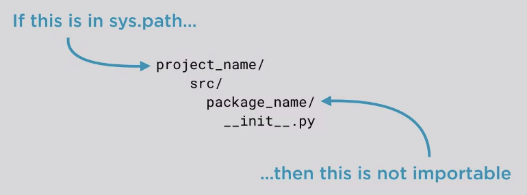
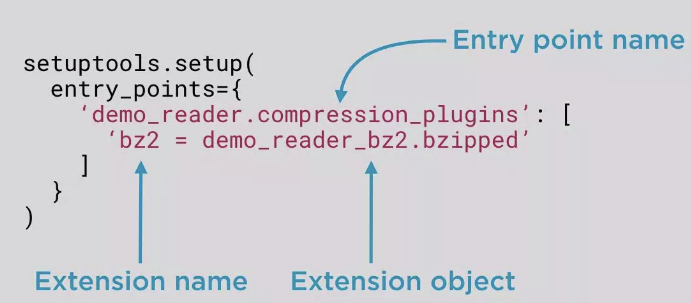
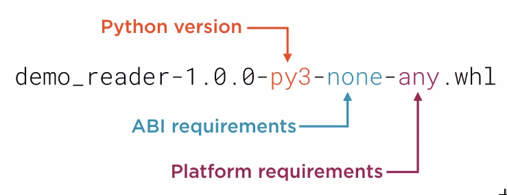

# core-python-organizing-larger-program-course

### Notes

Modules most often correspond to a single file

Packages are special modules: Modules that can contain other modules

Package modules have a __path__ attribute


sys.path
 - list of directies
 - when python imports a module it checks sys.path in order.
 - ImportError is raised if the module is not found
 
 
PYTHONPATH
 - environment variable
 - list of paths added to sys.path
 
 Windows
 set PYTHONPATH=path1;path2;path3
 
 Linux/Mac
 export PYTHONPATH=path1:path2:path3
 

```
python -m demo_reader.compressed.gzipped test.gzip data compressed with gzip
```


### Relative vs absolute imports

..module_name import name

## __all__

- module level attribute
- Controls form module import * behavior
- if not specified import all public names
- must be a list of strings
- each entry is a module to import


## Python package layout

```
project_name/
    README.(rst/md)
    docs/
    src/
        package_name/
            __init__.py
            more_source.py
            sub_package1/
                __init__.py
    tests/
        test_code.py

```

### README vs docs
README contains brief introduction to the package and refers to the docs for more in depth.

### Reasons for having a src/ dir
The source dir ensures that you develop against installed versions of you packages just like a user would.



### Separation of tests and production code
You dont want/need to have tests installed with the package. Avoids tools treating tests as production code.
 But above all be pragmatic. Put thest in production code if necessary.
 
 
## Package plugins

- Packages can define extension points
- Extensions are implemented outside the package
- Extensions are discovered at runtime

#### Two main methods for creating extensions(plugins)

- namespace packages and pkgutil
- setuptools *entry points*

Implementing plugins with namespace packages

- Core package designates subpackages as extension points
- Core package scans subpackages at runtime to discover plugins
- Plugins augment the namespace package's extensible subpackages

Implementing plugins with setuptools *entry points*

- Define extension points using *setuptools*
- Plugins add to extension points in setup.py
- Core package iterates over plugins added to extension points




## Distribution packages

- Archive of package contents
- Easy to install
- Various formats
    - zip files
    - tarballs
    - wheels

### Built vs Source packages

Built
 - Can be placed directly into a python installation directory
 - All build results are included in the package
 - Can be platform specific

Source
 - Contains everything needed to build the package
 - Cannot be placed directly into installation directory
 - It is necessary to build the package before installing it

Example create source distribution (standing in top level dir of a package with a setup.py)
```
python setup.py sdist
```

Example Built Packages
Most important build package format is *wheel*

You have to install the wheel package to make wheel distributions
```
pip install wheel
```

Example create wheel build distribution (standing in top level dir of a package with a setup.py)
```
python setup.py bdist_wheel
```

Requirements in Wheel format


### Publishing packages

Twine is a python package that can be usde to publish packages to PyPI
```
pip install twine
```

Publish package

```
twine upload <path to package dist>
```
